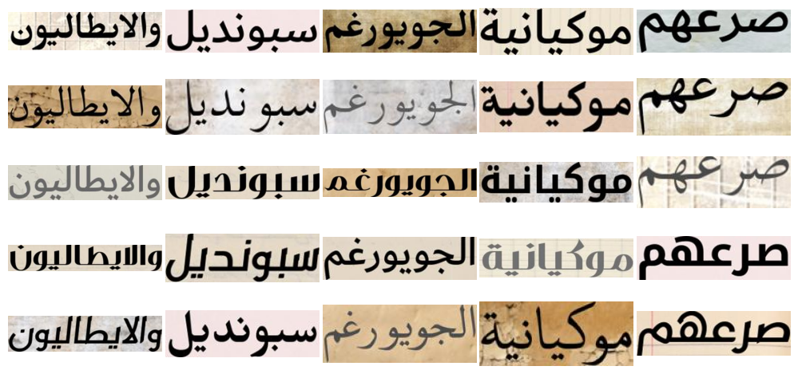
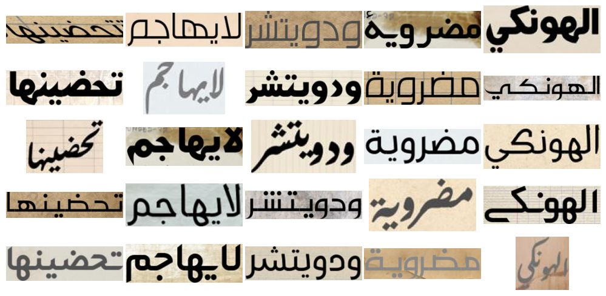

# $Khat^2$
This repository contains the code to generate and download the $Khat^2$ synthetic dataset presented in the paper "[One Stroke, One Shot: Diffusing a New Era in Arabic Handwriting Generation](https://ieeexplore.ieee.org/xpl/RecentIssue.jsp?punumber=4234)" as an adaptation of the $Font^2$[^1] dataset

## Acknowledgement 
This work builds, in part, on the code and methodology of HATFormer[^3][^4], and makes use of the large Arabic corpus they compiled. We thank the authors for making their resources publicly available.

<div align="center">
  
  
  <p><em>Figure 1: Sample images from the synthetic $Khat^2$ dataset showing different words, fonts, backgrounds, and augmentations </em></p>
</div>


## About
Inspired by the $Font^2$ dataset[^1][^2], we constructed a large synthetic dataset of Arabic word images rendered in a wide variety of fonts—including those that mimic handwriting. In our pipeline, **2,000+** freely available Arabic calligraphic fonts were scraped from multiple websites, then manually verified to ensure they correctly render every Arabic character (with decorative fonts containing elements like hearts or stars discarded). Additionally, drawing inspiration from HATFormer[^3][^4], we collected **130+** paper background images and used the large Arabic corpus they compiled which contains over **8.2 million** words collected from diverse online sources, including Wikipedia.

For a chosen number *N* (e.g., 1,000), we randomly select *N* words from the corpus (of varying lengths) and *N* fonts that pass our automated validation checks. We then render every possible combination of the selected words and fonts—resulting in $N×N$ (e.g., 1,000×1,000 = 1,000,000) image samples, with each font representing a distinct class (i.e., 1,000 images per font).

During the synthetic data generation process, for every *(word, font)* pair, the system randomly selects one of the background images and applies random augmentations (such as distortions and blur) before exporting the final image. Ground-truth labels—mapped to the corresponding font names—are stored in a CSV file, and these images are later used to train a ResNet-18 convolutional neural network backbone as part of a style encoder.

The generation code, background textures, corpus, and base font set are adapted from the HATFormer[^3] pipeline. We modified their codebase to generate single-word images instead of lines, to assign the font name as the class label, and to render a full $N×N$ grid of samples in the spirit of $Font^2$. We also adjusted the augmentations to better reflect the distortions used in $Font^2$.

## Dataset Generation
### Installing Dependencies
To set up the environment, make sure you have [conda](https://docs.conda.io/) installed. Then run:

```bash
conda env create -f environment.yaml
conda activate cloudspace
```

### Preparing the Dataset Directory

First, clone the dataset repository:

```bash
git clone https://github.com/7abushahla/Khat_Squared.git
cd Khat_Squared
```

Ensure the following structure exists inside the `dataset/` folder:

```
dataset/
├── fonts_2K/              # Folder with ~5,000 Arabic fonts (used to sample 2,000)
├── images/                # Background textures (e.g., paper scans)
├── words.pickle           # Arabic word corpus (8M+ words)
├── generation.py          # Main generation script
├── lines.py               # CSV generation script
├── gen_line_images.py     # Utility for rendering synthetic word images
├── image_distortion.py    # Augmentation and distortion functions
```

#### 📦 Download the large assets:

- [fonts_2K.zip (Google Drive)](https://drive.google.com/file/d/1Zii1J2yh8NL9A4Kjs5b8rdyUSQGHnGvg/view?usp=share_link)
- [images.zip (Google Drive)](https://drive.google.com/file/d/1Zj80lhG9Us7-zRgi8bv3v3WJT1zIo4C6/view?usp=share_link)
- [words.pickle (Google Drive)](https://drive.google.com/file/d/1hKd4x-FvgZiAtQdoHEZ-791FOSZ5e8oT/view?usp=share_link)

Unzip the downloaded folders and place them directly inside the `dataset/` directory.

---

### Running the Generation Pipeline

Once the structure is ready, navigate to the dataset folder:

```bash
cd dataset
```

Then run the image generation script:
```
python generation.py <dataset_size> <processes> <data_dir>
```
Example:
```
python generation.py 2000 64 test
```
Two directories will be created: `line_images` and `line_dict`.`line_dict` is a temporary directory used in `lines.py`. `line_images` will contain all synthetically generated images.

To generate a CSV file mapping each image to its corresponding word label, run:

```
python lines.py <base_image_dir>
```
Example:
```
python lines.py test
python lines.py
```
This will create a `data.csv` file in the specified directory, containing `img_path` and `text` columns.


## Download Pre-Generated Dataset

If you prefer not to generate the dataset yourself, you can directly download the pre-generated 2,000-font $Khat^2$ variant used in our study:

👉 [Download: 2,000 Fonts × 2,000 Words (4M samples)](https://drive.google.com/file/d/10rOgKsOINfPUdUKqtc-xEtgcmdvSDUF-/view?usp=share_link)

---

[^1]: https://github.com/aimagelab/font_square
[^2]: https://arxiv.org/abs/2304.01842
[^3]: https://zenodo.org/records/14165756
[^4]: https://arxiv.org/abs/2410.02179
